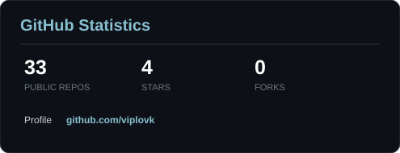
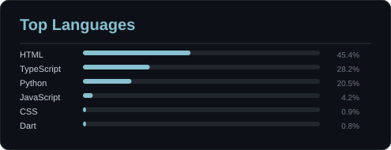

 

  

  

<picture>
  <source media="(prefers-color-scheme: dark)" srcset="https://raw.githubusercontent.com/viplovk/viplovk/output/github-contribution-grid-snake-dark.svg">
  <source media="(prefers-color-scheme: light)" srcset="https://raw.githubusercontent.com/viplovk/viplovk/output/github-contribution-grid-snake.svg">
  
</picture>

   

&nbsp;&nbsp;

   

  

<!-- Guestbook -->

<table>
<tr><th width="25%">NAME</th><th width="20%">DATE</th><th width="55%">MESSAGE</th></tr>
<tr><td align="center"><a href="https://github.com/viplovk"> <b>viplovk</b></a></td><td align="center">04 Sep 2026</td><td>hewlo boys</td></tr>
<tr><td align="center"><a href="https://github.com/viplovk"> <b>viplovk</b></a></td><td align="center">03 Sep 2026</td><td>hi8</td></tr>
<tr><td align="center"><a href="https://github.com/viplovk"> <b>viplovk</b></a></td><td align="center">03 Sep 2026</td><td>hewlo boys</td></tr>
</table>

<!-- /Guestbook -->

  

  

